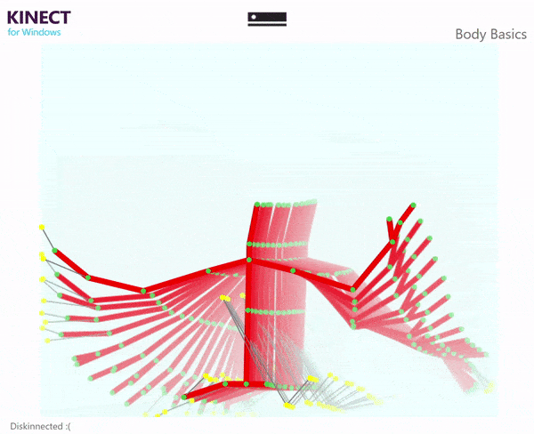

# CSE 118 - Lab #1 - Microsoft Kinect

In this lab, we covered Microsoft Kinect v2 SDK basics.
Introductory slides are available here:
The video recording is available here:

## Screenshot

The code available here is based on `Body-Basics` and merely creates a visual effect by reusing previous frames:

# Relevant Links

## Microsoft Kinect v2

**Basic API walkthrough** [https://pterneas.com/2014/02/20/kinect-for-windows-version-2-color-depth-and-infrared-streams/](https://pterneas.com/2014/02/20/kinect-for-windows-version-2-color-depth-and-infrared-streams/)

**Coordinate Mapping** [https://www.codeproject.com/Articles/769608/Understanding-Kinect-Coordinate-Mapping](https://www.codeproject.com/Articles/769608/Understanding-Kinect-Coordinate-Mapping)

### Microsoft Kinect v2 and other programming languages
**Python** [https://github.com/Kinect/PyKinect2](https://github.com/Kinect/PyKinect2)

### Windows Presentation Foundation (WPF)
If you are building your application based on the C# samples, most of them use WPF for drawing on the screen. WPF's API is quite involved and doing basic operations such as reusing a drawing or drawing several points might be time consuming for the developer and cpu-intensive. The links below introduce basic concepts as well as some more advanced ones:

**Microsoft Docs' WPF overview** [https://docs.microsoft.com/en-us/dotnet/framework/wpf/graphics-multimedia/shapes-and-basic-drawing-in-wpf-overview](https://docs.microsoft.com/en-us/dotnet/framework/wpf/graphics-multimedia/shapes-and-basic-drawing-in-wpf-overview)

**Drawing Bitmaps - DrawingImage and DrawingVisual:** [https://www.i-programmer.info/programming/wpf-workings/555-drawing-bitmaps-drawingimage-and-drawingvisual-.html](https://www.i-programmer.info/programming/wpf-workings/555-drawing-bitmaps-drawingimage-and-drawingvisual-.html)

